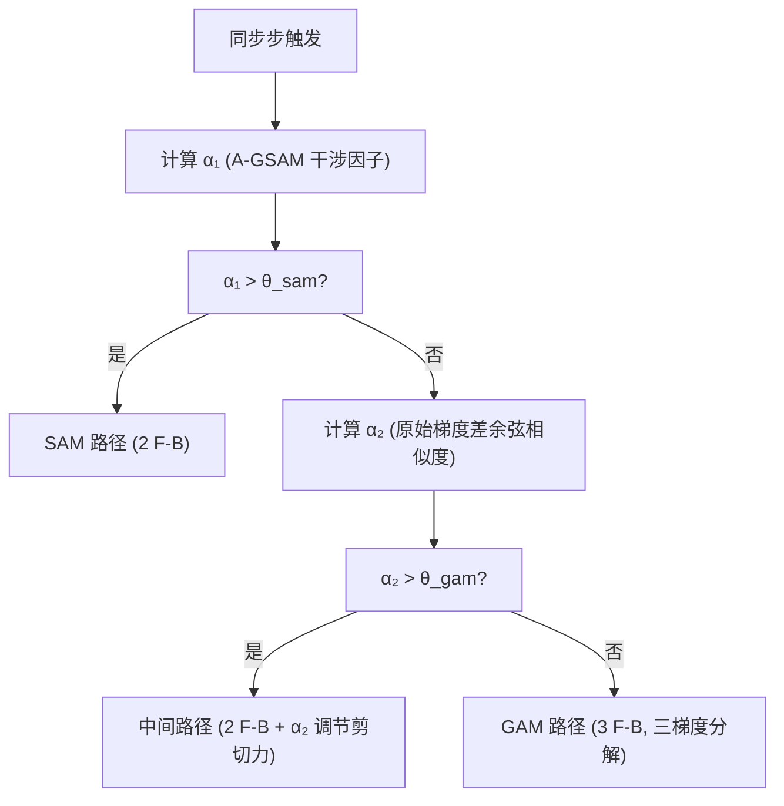
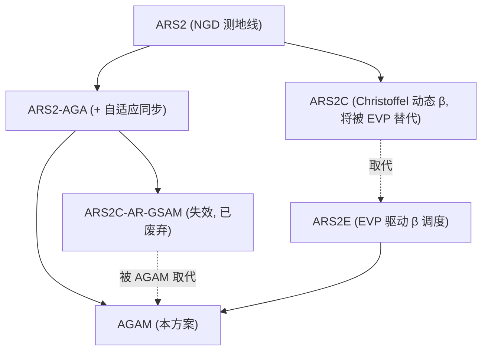

# AGAM: Adaptive Geometric Awareness Minimization

## 0. 问题：连续曲率调制为什么不可靠

在 SAM 族方法中，扰动半径 `ρ` 控制对抗扰动的幅度。如果让 `ρ` 随局部曲率自适应变化，就能在平坦区域信任 NGD、在粗糙区域加大平坦化压强——这个思路催生了 AR-GSAM 的动态 `ρ` 调制。

AR-GSAM 在高精度微调阶段全面失效，暴露三个耦合缺陷：

- *反馈循环发散*：`ρ_target = ρ_min · f_c · f_a` 中，`f_a = 1 + (1 − cos_sim)` 依赖 `cos_sim`，而 `cos_sim` 又受当前 `ρ` 影响（更大 ρ → 更大扰动 → 更差 Hessian 线性近似 → 更低 cos_sim）。正反馈形成：`cos_sim` 低 → `f_a` 膨胀 → `ρ` 膨胀 → 扰动增大 → Hessian 近似更差 → `cos_sim` 进一步降低。
- *信号退化*：在 Grokking 高精度微调阶段（>98% Eval Acc），梯度小而曲率变化大，`cos_sim` 在 `[0.1, 0.3]` 退化为随机游走。`ρ` 的调制信号已丧失几何意义。
- *全局标量压缩*：单一 `cos_sim` 标量将高维 Christoffel 方向的各向异性曲率信息压缩为一个值，Fisher 流形结构细节完全丢失。

*根源*：只要 `ρ` 参与决定下一次的 `cos_sim`，反馈循环就不可能被彻底切断。

## 1. 离散切换：切断反馈循环

连续调制的困境指向替代方案：用离散的路径选择替代连续的 `ρ` 缩放。

不试图在 `[ρ_min, ρ_max]` 内精细调节 `ρ`，而是维护 2–3 个离散的扰动深度档位——每个档位对应固定的扰动策略和计算开销。决策信号只负责在档位间切换，不参与任何连续反馈。

档位切换后，`ρ` 在该步内是固定值，不参与该步的曲率估计。下一次决策信号基于当前档位的输出重新计算，不存在跨步耦合。

这引出了关键问题：*切换阈值如何确定？* 经验猜测不可靠——AR-GSAM 的失效已证明对几何信号做正确经验判断的困难。

## 2. 双对齐度：决策信号构造

从两个正交的几何维度刻画局部流形状态。

### 2.1 α₁：曲率-更新方向对齐

复用 ARS2 的全局干涉因子 `ϕ_t`：

`α₁ = ϕ_t = (∑⟨g_t, v_flat⟩) / (√∑‖g_t‖² · √∑‖v_flat‖²)`

`v_flat` 是最近同步步缓存的剪切力向量（正交于基础梯度）。α₁ 测量当前梯度方向与上次同步步检测到的正交曲率方向之间的一致性。α₁ 高时，流形在梯度方向上的曲率变化小，SAM 的 `δ_g = g_adv − g_base` 信号信噪比高。

### 2.2 α₂：二阶结构自洽性

在 SAM 扰动基础上做一次额外小半径扰动，获得两个梯度差：

`δ_g = g_adv − g_base`  —— SAM 扰动前后的梯度差
`δ_g' = g_adv' − g_adv`  —— 第二次扰动前后的梯度差

`α₂ = |⟨δ_g, δ_g'⟩| / (‖δ_g‖ · ‖δ_g'‖)`

*直接使用原始梯度方向的余弦相似度*，避免 NS 正交化引入的方向畸变。在 Hessian 变化慢的区域，`δ_g` 和 `δ_g'` 编码的曲率结构自洽，α₂ → 1；反之 α₂ 下降。

α₂ 衡量的不是严格的 Hessian 线性度（`δ_g` 和 `δ_g'` 分别编码 `H·ĝ` 和 `H²·ĝ`），而是二阶结构在二次扰动后的自洽性——这足以作为工程触发信号。

### 2.3 互补性

α₁ 和 α₂ 编码不同层次的几何信息，在光滑流形上呈正相关而非正交：

- α₁ 高 + α₂ 高：流形平滑 + Hessian 稳定 — SAM 路径最优
- α₁ 低 + α₂ 高：梯度旋转但二阶结构稳定（如过一阶鞍点）— 中间路径
- α₁ 高 + α₂ 低：理论禁区（梯度稳定但 Hessian 突变需拟奇点结构）
- α₁ 低 + α₂ 低：流形粗糙 + Hessian 不稳定 — GAM 路径必须

## 3. 等分布阈值校准

离散切换的关键难题——阈值确定——由等分布原理（Equidistribution Principle, de Boor 1973）解决。它来自自适应网格理论：最优网格应使每个单元的误差贡献相等。

对应到 GAM 触发：最优触发阈值 `τ` 应使被选中执行 GAM 路径的步贡献相等比例的曲率信息。

设 `c_i` 为第 `i` 步的 Christoffel 范数 `‖C‖_F`，等分布条件：

`∑_{i: c_i > τ} c_i ≈ (1/N) · ∑_i c_i`

其中 `N` 是期望触发比例（如 `N = 3` 表示约 1/3 的总曲率由触发步捕获）。

*实现方案*：维护滑动窗口 `W = [c_{t-K}, ..., c_t]`，`K = 1000`。每次触发决策时：

1. 计算窗口内曲率均值 `μ` 和标准差 `σ`
2. 计算 `τ_equidist = μ + λ_equidist · σ`，`λ_equidist` 从目标触发率 `N` 反推
3. 实际阈值 `τ = max(τ_equidist, τ_min)`

当曲率分布高度集中时（少数步包含大部分曲率信息），阈值自动升高。

自适应网格对比：

- 网格密度 `h(x)` → AGAM SAM 扰动半径 `ρ`
- 监控函数 `ρ(x)` → AGAM Christoffel 范数 `‖C‖_F`
- 等分布原理 → AGAM 曲率等分布触发阈值
- h-adaptive（细化/粗化） → AGAM GAM 路径开关

## 4. MPS：参数空间普朗克截断

Model Planck Scale（MPS）提供阈值的绝对下界。

*核心公式*：

`τ_min = η · ε · √d`

其中 `d` 为参数总数，`ε` 为机器 epsilon（格式相关），`η` 为当前学习率。

*推导路径*：

```
IEST 全息对偶 → 体空间 d 维 → 面空间 √d 维
→ 理想自然梯度流下的曲率可分辨性 → τ_min⁰ = ε · √d
→ 现实离散更新加入学习率缩放 → τ_min = η · ε · √d
```

*物理直觉*：在理想自然梯度流 `dθ/dt = -F(θ)⁻¹∇L(θ)` 中，参数空间测地线的曲率分辨精度仅受限于浮点表示 `ε` 与全息投影 `√d`。但现实使用离散更新 `θ_{t+1} = θ_t - η · F̂(θ_t)⁻¹∇L(θ_t)`，学习率 `η` 缩放整个更新步长——它相当于参数空间的*超分辨率因子*。当曲率变化幅度小于 `η · ε · √d` 时，二阶修正的变化量小于离散更新步长的数值分辨率，执行 GAM 路径的收益为零。

实际训练中 `η` 随调度变化：预训练阶段（`η≈1e-3`）τ_min 在 `10⁻⁷~10⁻²` 量级；微调阶段（`η≈1e-5`）τ_min 降至 `10⁻⁹~10⁻⁴`，MPS 约束自动松弛。原始 `ε·√d`（无 η 缩放）在 FP32 下达 `~10⁻⁴`，远大于实际梯度变化，会系统性抑制高曲率区域探索——加入 `η` 后才恢复真实可分辨性。

*浮点格式 epsilon 速查*（机器 epsilon = `2⁻ᵐ`，m 为尾数位）：

| 格式 | 尾数位 | `ε` | 备注 |
|:---|:---:|:---:|:---|
| FP32 | 23 | `1.192e-07` | 2⁻²³，标准单精度 |
| FP16 | 10 | `9.766e-04` | 2⁻¹⁰ |
| BF16 | 7 | `7.812e-03` | 2⁻⁷ |
| FP8 E4M3 | 3 | `1.250e-01` | 2⁻³，标准 8 位 |
| FP8 E3M4 (OCP) | 4 | `6.250e-02` | 2⁻⁴，实验性 |
| FP8 E5M2 | 2 | `2.500e-01` | 2⁻² |

*`τ_min` 数值示例*（`η=1e-3`，典型预训练）：

| 模型 | `d` | FP32 | FP16 | BF16 | FP8 E4M3 |
|:---|:---:|:---:|:---:|:---:|:---:|
| ResNet-18 (CIFAR-10) | 11M | `3.95e-7` | `3.24e-3` | `2.59e-2` | `4.15e-1` |
| 3L Transformer (Wiki-2) | 5M | `2.67e-7` | `2.18e-3` | `1.75e-2` | `2.80e-1` |
| Grokking (p=113) | 0.1M | `3.77e-8` | `3.09e-4` | `2.47e-3` | `3.95e-2` |

*学习率缩放示例*（ResNet-18, d=11M, FP32）：

| `η` | `τ_min` | 典型阶段 |
|:---:|:---:|:---|
| `1e-3` | `3.95e-7` | 预训练前期 |
| `3e-4` | `1.19e-7` | 预训练中后期 |
| `1e-4` | `3.95e-8` | 微调 |
| `1e-5` | `3.95e-9` | 高精度微调 |

τ_min 随 `η` 自动缩放，MPS 在新精度格式下仍有效——FP8 的 τ_min 较高（`0.1~0.4`），但低精度训练本身梯度噪声就大，等分布条件的有效曲率阈值也会相应提高，两者大致对齐。

*三层自适应*：

- 全局：`τ = max(τ_equidist, α · η · ε · √d)`，`α = 1.0` 默认
- 精度自适应：浮点格式切换时 `ε` 自动调整
- 学习率自适应：`η` 随 warmup/cosine decay 等调度自动缩放 τ_min
- 层级别：`τ^(l) = η · ε · √(d_l)`，小参数量层对曲率更敏感

## 5. 三路切换逻辑

在每次同步步中：

```python
if α₁ > θ_sam:
    # SAM 路径 (2 F-B)
    # 标准 δ_g 构造 shear_force
    # 复用 α₁ 的 EMA 更新 A-GSAM 状态

elif α₂ > θ_gam:
    # 中间路径 (2 F-B + α₂ 调节剪切力)
    α_shear = α_base * (1 + (1 - α₂))
    # 保持 ρ 不变，切断间接反馈循环

else:  # α₁ ≤ θ_sam AND α₂ ≤ θ_gam
    # GAM 路径 (3 F-B)
    # 三梯度分解
    # 使用分解前的 g_adv - g_base 构造 shear_force
```

*关键设计决策*：中间路径用 α₂ 调节剪切力强度而非 ρ 放大。这切断了唯一的间接反馈路径——ρ 增大不再影响下一次 α₂ 的估计（α₂ 使用固定 ρ_small），同时 α₂ 不参与 ρ 的更新。

θ_sam 和 θ_gam 由等分布条件从 α₁ 和 α₂ 的历史分布自动确定（参见第 3 节），且 `τ_min = max(θ_sam, θ_gam)` 确保阈值不低于 MPS 物理截断。



## 6. GAM 路径详细定义

### 6.1 加速 GAM 变体

两扰动三梯度的加速变体：

1. 基础步：保存 `g_base = ∇L(θ)`
2. SAM 扰动：`θ' = θ + ρ · ĝ`，计算 `g_adv = ∇L(θ')`
3. 第二次扰动：`θ'' = θ' + ρ_small · δ_g / ‖δ_g‖`，计算 `g_adv' = ∇L(θ'')`

梯度分解：

- `δ_g = g_adv - g_base` — 一阶曲率信号
- `δ_g' = g_adv' - g_adv` — 二阶曲率信号
- `parallel = ⟨g_base, δ_g⟩ / ‖δ_g‖² · δ_g` — 沿曲率方向的投影
- `vertical = g_base - parallel` — 垂直分量，GAM 的一阶平坦度校正
- 合成梯度：`g_final = vertical + β₁ · δ_g + β₂ · δ_g'`

超参数（GAM 论文建议值，经验证）：

- `β₁ = 0.2` — 一阶曲率校正权重
- `β₂ = 0.1` — 二阶曲率校正权重
- `ρ_small = ρ/10` — 第二步扰动半径，上限钳位 `0.1`

### 6.2 剪切力构造规则

GAM 路径中使用分解前的 `g_adv - g_base` 构造剪切力：

`state['shear_force'] = g_adv - g_base`

确保剪切力始终正交于基础梯度，非同步步注入时不会引入系统性偏置。

### 6.3 EVP 驱动的离散 ρ 分配

#### 6.3.1 问题

AGAM 的三路切换架构中，路径选择由 EVP + MPS 联合决定（第 3 节），但每条路径的扰动半径 ρ 在原始文档中未定义。本节补充 EVP → ρ 的映射推导。

#### 6.3.2 分层法则

从 IEST 体→面全息投影结构：体空间的 d 个自由度经投影缩减为 √d 个有效面自由度。二者之间，曲率信息集中在三个深度层上，分别对应三条路径的覆盖范围：

- Layer 1 (SAM 路径): `c_norm ∈ [τ_min, τ₁)` 低曲率
- Layer 2 (Middle 路径): `c_norm ∈ [τ₁, τ₂)` 中曲率
- Layer 3 (GAM 路径): `c_norm ∈ [τ₂, ∞)` 高曲率

其中 τ₁, τ₂ 由 EVP 等分布条件自动校准（令 N_path = 3，使每层的曲率和 ≈ 总曲率的 1/3）。

#### 6.3.3 信噪比约束

每条路径的 ρ 必须保证扰动梯度差 δ_g 的信噪比不低于 MPS 截断 ε·√d。各路径对信噪比的敏感度不同：

*SAM 路径*（单次扰动）：
`‖δ_g‖ ≈ ρ · λ_max · ‖ĝ‖ ≥ ε·√d`
`ρ_sam ≥ A, where A = (ε·√d) / (λ_max · ‖ĝ‖)`

*GAM 路径*（需二次扰动 δ_g'）：
`‖δ_g'‖ ≈ ρ_small · ‖δ_g‖ ≈ (ρ/10) · (ρ · λ_max · ‖ĝ‖) = ρ²/10 · λ_max · ‖ĝ‖`
`ρ_gam ≥ √(10 · A)`

GAM 路径因二次扰动而承受平方根放大的信噪比下界。若低曲率区需触发 GAM 路径，ρ 必须显著大于 ρ_sam。但 EVP 将低曲率步全部分配给 SAM 路径——GAM 路径仅在 c_norm ≫ τ_min 的步上触发，此时 λ_max 极大，A → 0, √(10·A) → 0，ρ_base 天然满足约束。

*中间路径*（无二次扰动，仅剪切力调制）：
`ρ_mid` 仅需满足 SAM 路径的线性下界 ρ ≥ A。在中曲率层 A 适中，ρ_base 维持可分辨性。

#### 6.3.4 共享 ρ 的结论

三路径的信噪比约束在各自分配的曲率层内均被 ρ_base 满足：

- SAM 路径：曲率层低，信噪比约束 ρ ≥ A，实际 ρ_base，条件 A 小（τ_min 量级），ρ_base 充足
- Middle 路径：曲率层中，信噪比约束 ρ ≥ A，实际 ρ_base，条件 A 适中，ρ_base 维持
- GAM 路径：曲率层高，信噪比约束 ρ ≥ √(10·A)，实际 ρ_base，条件 λ_max 极大 → A → 0，约束自动消失

*三路径共享同一个 ρ_base，不需要分层缩放。*

这是反直觉但正确的结论："离散扰动深度"不通过 ρ 的值实现，而是通过路径内部的计算策略（剪切力构造方式、梯度分解深度）实现。AGAM 的离散调制在算法结构层，不在 ρ 的数值层。

#### 6.3.5 与 AR-GSAM 的根本差异

AR-GSAM 试图用连续 cos_sim 信号连续调制 ρ。AGAM 将路径选择与 ρ 解耦——路径切换处理曲率变化，ρ 保持固定。反馈回路被切断不是因为有上限钳位，而是因为 ρ 根本不参与下一次的决策信号计算。

```
AR-GSAM:   曲率变化 → cos_sim → 调制 ρ → 影响下一次的曲率估计     正反馈
AGAM:   曲率变化 → α₁/α₂ → 选择路径（ρ 固定）→ 不影响下一次的信号    已切断
```

## 7. 零调参的达成

等分布原理和 MPS 共同消除了所有经验阈值：

- `θ_sam` 和 `θ_gam`：由等分布条件自动校准 — α₁ 和 α₂ 的历史分布动态决定分位点
- `τ`：MPS 提供物理下界 `τ_min = ε · √d` — 无数据依赖，无调参
- 曲率分布变化时阈值自适应调整 — 无需提前扫描经验分布
- `ρ_small`：固定为 `ρ/10`，上限钳位 `0.1` — 纯工程常数

## 8. 计算开销

*路径开销*：

- SAM 路径：2 F-B，1 梯度缓存 + 1 剪切力缓存
- 中间路径：2 F-B，1 梯度缓存 + 1 剪切力缓存 + 点积
- GAM 路径：3 F-B，2 梯度缓存

典型期望：大部分训练阶段 α₁ 保持高位（> 0.3），平均开销接近 2 F-B。

*基准开销*（CIFAR-10, ResNet-18, Batch 256）：

| 优化器 | 每 epoch (s) | 相对 AdamW |
|:---|:---:|:---:|
| AdamW | 57.8 | 1.00x |
| ARS2-Neo Base | 70.9 | 1.23x |
| ARS2-Neo A-GSAM | 90.0 | 1.56x |
| ARS2-Neo Sync | 104.5 | 1.81x |

AGAM 预估平均开销 < 1.6x AdamW（2 F-B 为主 + 偶发 3 F-B）。

## 9. 与 ARS 家族的关系

AGAM 独立于 ARS 的测地线更新核心，专注 MDL 平坦度约束侧的预算分配。两者通过 EVP（等分布变分原理）耦合——EVP 同时决定了 ARS 侧的 β 调度和 AGAM 侧的触发阈值。



*机制对比*：

- 能量-几何解耦：ARS2 ✓，AGAM (继承)
- SAM 平坦度：ARS2 ✓，AGAM ✓
- A-GSAM 自适应同步：ARS2 ✓，AGAM ✓
- 双对齐度切换：ARS2，AGAM ✓
- EVP 阈值校准：ARS2，AGAM ✓
- MPS 物理截断：ARS2，AGAM ✓
- GAM 三梯度路径：ARS2，AGAM ✓

## 10. 参考文献

- [1] de Boor (1973), "Good Approximation by Splines with Variable Knots"
- [2] Huang, Ren, Russell (1994), "Moving Mesh PDEs based on Equidistribution Principle"
- [3] P. Foret et al., "Sharpness-Aware Minimization," ICLR 2021
- [4] J. Zhuang et al., "GSAM: Surrogate Gap Guided Sharpness-Aware Minimization," ICLR 2022
- [5] X. Zhang et al., "Gradient Norm Aware Minimization," CVPR 2023 (Highlight)
- [6] ARS 系列设计文档: [`1-ARS.md`](.roo/rules/1-ARS.md:1), [`1-ARS2.md`](.roo/rules/1-ARS2.md:1), [`2-AR-GSAM.md`](.roo/rules/2-AR-GSAM.md:1)
- [7] IEST

- 状态：设计定稿，待实验验证
- 依赖：[`1-ARS2.md`](.roo/rules/1-ARS2.md:1) 中的 A-GSAM 同步机制，[`2-AR-GSAM.md`](.roo/rules/2-AR-GSAM.md:1) 的失效诊断
- 验证基准：Grokking (Modular Addition) 应为首要验证任务
