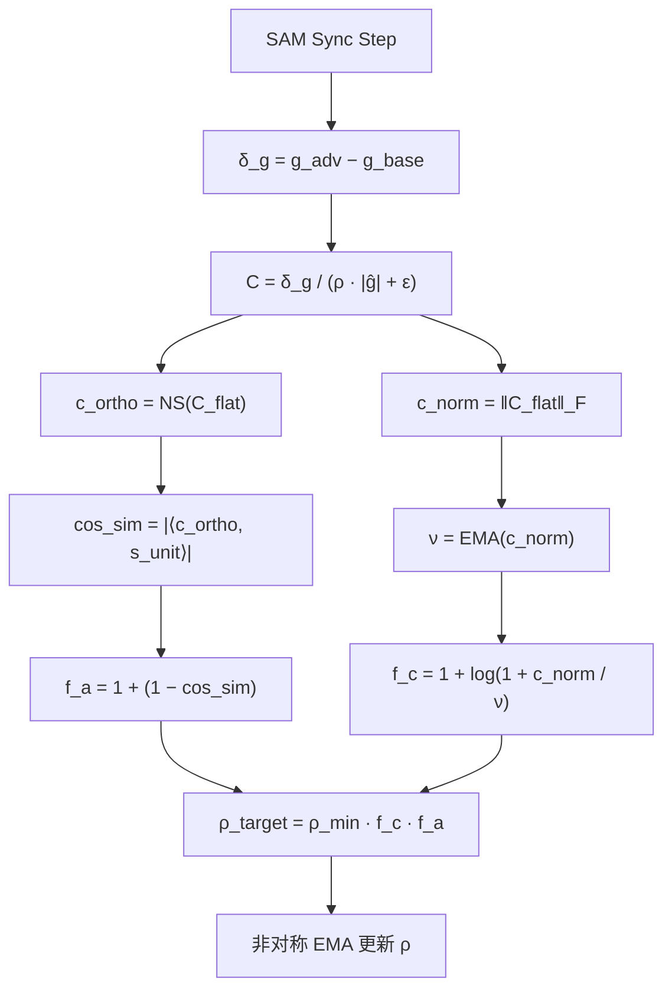

# AR-GSAM：Curvature-Aligned Dynamic Rho Modulation

## 0. 原理概述

AR-GSAM 在 [`1-ARS2`](.roo/rules/1-ARS2.md:1) 的平坦度约束之上引入*曲率对齐调制*，其核心命题是：

- ARS2 的扰动半径 `ρ` 本应由地形的局部几何直接决定，而非启发式规则。
- ARS2C 的 Christoffel 矩阵提供了两个正交的几何信号：曲率强度 `‖C‖_F` 和方向对齐度 `cos_sim`。
- 两者乘性组合驱动 `ρ` 的动态调制，消除基于 `dL/dt` 或代理间隙 `h_t` 的启发式反馈循环。



## 1. 几何信号

### 1.1 Christoffel 矩阵构造

在 ARS2C 的 SAM 同步步中，梯度差 `δ_g = g_adv − g_base` 近似于 Hessian-向量积。经归一化与 Newton-Schulz 正交化后得到曲率方向：

`c_ortho = NS(C_flat)`，其中 `C = δ_g / (ρ · |ĝ| + ε)`

更新方向的正交化版本：

`s_ortho = NS(ĝ)`，其中 `ĝ = m̂ / √v̂`

### 1.2 两个正交标量信号

- `c_norm = ‖C_flat‖_F`：来自 Christoffel 矩阵 Frobenius 范数，值域 `[0, ∞)` 实测 5~5000+，编码流形局部弯曲的*强度*——Hessian 在扰动方向上的变化总量
- `cos_sim = |⟨c_ortho, s_unit⟩|`：来自矩阵余弦相似度（标量），值域 `[0, 1]`，编码曲率方向与更新方向的*夹角*——弯曲是否与优化路径对齐

两者*正交*：Mini-Wikitext2 实验数据显示 `c_norm` 在 4.94→166.60 剧烈波动时 `alignment_mean` 纹丝不动（0.507→0.514）。

### 1.3 cos_sim 计算

```python
s_flat = s_ortho.view(s_ortho.size(0), -1)
s_unit = s_flat / (s_flat.norm() + 1e-12)
cos_sim = float((c_ortho * s_unit).sum().abs())
```

成本为一个逐元素乘法和求和，可忽略。

## 2. ρ 更新律（New AR-GSAM）

### 2.1 设计原则

- *零新增超参数*：所有新引入的量（`ν`、`cos_sim`）都是在线计算的状态变量。
- *log 压缩曲率*：借鉴 CR-SAM 的 `log(Tr(H))` 方案，用无参数数学变换替代需要调参的 clipping/damping 阈值。
- *乘性组合*：曲率高 AND 对齐度低时 ρ 才显著膨胀；曲率高但对齐完美 → 信任 NGD；曲率低 → 无论对齐如何，ρ 接近 `ρ_min`。
- *非对称更新*：快速膨胀（`rho_eta`）、缓慢收缩（`rho_kappa`），复用现有参数。

### 2.2 更新公式

```
ν_t = β_ema · ν_{t-1} + (1 − β_ema) · c_norm          (1) 曲率 EMA 基线

f_c = 1 + log(1 + c_norm / (ν_t + ε))                  (2) 曲率响应
f_a = 1 + (1 − cos_sim)                                 (3) 对齐响应

ρ_target = ρ_min · f_c · f_a                            (4) 乘性组合
ρ_target = clamp(ρ_target, ρ_min, ρ_max)                (5) 安全钳

if ρ_target > ρ_current:
    ρ_new = ρ_current + η_rise · (ρ_target − ρ_current)  (6a) 快速膨胀
else:
    ρ_new = ρ_current + κ · (ρ_target − ρ_current)       (6b) 缓慢收缩
```

### 2.3 参数语义

- `β_ema`：复用 `adaptive_beta`，曲率 EMA 衰减率，控制基线的记忆长度
- `ρ_min`：现有，扰动半径下界，对齐完美 + 曲率基线时的稳态值
- `ρ_max`：现有，扰动半径上界，安全钳
- `η_rise`：复用 `rho_eta`，快速膨胀速率，响应几何漂移
- `κ`：复用 `rho_kappa`，缓慢收缩速率，确认流形平滑后才回缩

*总计：零新增超参数。*

### 2.4 动力学分析

*f_c 的响应曲线*：

- `c_norm / ν` = 1 → `log(1 + ratio)` = 0.69 → `f_c` = 1.69 → 曲率处于基线
- `c_norm / ν` = 10 → `log(1 + ratio)` = 2.40 → `f_c` = 3.40 → 曲率飙升 10×
- `c_norm / ν` = 100 → `log(1 + ratio)` = 4.62 → `f_c` = 5.62 → 曲率飙升 100×
- `c_norm / ν` = 1000 → `log(1 + ratio)` = 6.91 → `f_c` = 7.91 → 极端曲率（log 压缩确保不爆炸）

*f_a 的响应曲线*：

- `cos_sim` = 1.0 → `f_a` = 1.0 → 完美对齐，不放大
- `cos_sim` = 0.5 → `f_a` = 1.5 → 中度失配
- `cos_sim` = 0.0 → `f_a` = 2.0 → 完全正交，最大放大

*乘性组合的典型场景*：

- 理想滑行：`c_norm/ν` = 1, `cos_sim` = 1.0 → `f_c` = 1.69, `f_a` = 1.0 → `ρ_target / ρ_min` = *1.69*
- 曲率飙升 + 完美对齐：`c_norm/ν` = 100, `cos_sim` = 1.0 → `f_c` = 5.62, `f_a` = 1.0 → `ρ_target / ρ_min` = *5.62*
- 曲率基线 + 方向失配：`c_norm/ν` = 1, `cos_sim` = 0.0 → `f_c` = 1.69, `f_a` = 2.0 → `ρ_target / ρ_min` = *3.38*
- 曲率飙升 + 方向失配：`c_norm/ν` = 100, `cos_sim` = 0.0 → `f_c` = 5.62, `f_a` = 2.0 → `ρ_target / ρ_min` = *11.24*

曲率高 AND 对齐度低时 ρ 才显著膨胀——这正是 Grokking 所需的"在混沌地形中炸开新结构"的物理条件。

## 3. 平台期加压与 Grokking

当损失停滞（`dL/dt ≈ 0`）时，NGD 更新进入 Hessian 零空间，`s_ortho` 丧失曲率对齐 → `cos_sim` 自动下降 → `f_a` 自动增大 → `ρ` 自动膨胀 → SAM 扰动在地形中炸出新结构 → Grokking 的触发机制。

不需要显式的平台期检测或 `κ_t` 动态调度，对齐度天然承载了探索/利用切换信号。

## 4. AR-GSAM 与连续 Kolmogorov 复杂度逼近

AR-GSAM 提供了一个可操作的视角：优化器以 `ρ` 作为连续二分搜索的探针，逼近模型-数据集对的 Kolmogorov 压缩极限。

- 当 `cos_sim → 1` 时，更新始终与残差曲率对齐，说明已无未建模的结构剩余 → 系统已逼近压缩极限。
- 当 `cos_sim → 0` 时，存在未建模的曲率结构 → 需要增大 `ρ` 以平坦化地形，使结构暴露给 NGD 捕获。

因此 AR-GSAM 的本质是：*以曲率对齐为探针的连续 Kolmogorov 复杂度逼近过程*。由于 K 复杂度在理论上不可判定，AR-GSAM 通过连续流形上的几何调制收敛到其可计算代理值。

## 5. 与 β 调制的分工

AR-GSAM 控制 `ρ`（扰动半径），ARS2C 控制 `β₁, β₂`（动量衰减）。两者由同一组几何信号驱动，但作用于不同维度：

- 高 `cos_sim`：β（ARS2C）高 β（强滤波，保留历史动量），ρ（AR-GSAM）低 ρ（信任 NGD，减少扰动）
- 低 `cos_sim`：β（ARS2C）低 β（快速遗忘，适应曲率突变），ρ（AR-GSAM）高 ρ（平坦化压强，炸开尖锐极小值）
- 高 `c_norm`：β（ARS2C）通过 `alignment_matrix` 逐元素调制，ρ（AR-GSAM）通过 `f_c` 全局放大 ρ

两者*同向互补*：高对齐时同时进入"利用"模式（强记忆 + 小扰动），低对齐时同时进入"探索"模式（弱记忆 + 大扰动）。

## 6. 代码锚点

### 6.1 现有基础设施（ARS2C / ARS2C-AR-GSAM）

- Christoffel 矩阵构造：[`_C = _delta_g / (rho * _g_hat.abs() + _eps)`](optimizer/ars2c.py:168)
- 曲率方向正交化：[`state['c_ortho'] = zeropower_via_newtonschulz5(_c_flat)`](optimizer/ars2c.py:171)
- 曲率范数：[`state['c_magnitude'] = float(_c_flat.norm())`](optimizer/ars2c.py:170)
- 行列双向对齐矩阵：[`state['alignment_matrix'] = torch.sqrt(row_alignment * col_alignment)`](optimizer/ars2c.py:270)
- 逐元素动态 β：[`exp_avg.mul_(beta1_matrix)`](optimizer/ars2c.py:227)
- 诊断输出：[`diagnostics`](optimizer/ars2c.py:279)

### 6.2 New AR-GSAM 待实现锚点

- `cos_sim` 计算：在 `_apply_ars2_kernel` 中，`c_ortho` 与 `s_unit` 的内积
- `ν` EMA 更新：复用 `adaptive_beta` 对 `c_norm` 做指数滑动平均
- `f_c` 计算：`1 + log(1 + c_norm / (ν + ε))`
- `f_a` 计算：`1 + (1 − cos_sim)`
- `ρ_target` 乘性组合：`ρ_min * f_c * f_a`
- 非对称 EMA：`rho_eta`（上升）/ `rho_kappa`（下降）
- 扰动注入：sync step 中使用 `state['rho']` 替代全局 `rho`

## 7. 历史存档

> *架构冻结公告*：以下为旧 AR-GSAM 的设计记录，已被 New AR-GSAM（第 2 节）取代。保留此存档用于机制对比与理论分析。

### 7.1 旧版缺陷

1. *线性映射失效*：`ρ_target = ρ_min + (ρ_max − ρ_min) · A_t` 在 alignment 全程偏低时（Wikitext-2 上 ≈ 0.09~0.29），ρ 被锁死在极小范围，从未达到能炸开尖锐极小值的物理尺度。
2. *sigmoid 门控饱和*：`mag_gate = σ(c_magnitude)` 在 `c_magnitude > 5` 后完全饱和为 1，丢弃了 `‖C‖_F` 携带的丰富几何信息。
3. *全局标量退化*：`alignment_raw = (c_ortho * s_unit).sum().abs()` 将高维 Christoffel 方向压缩为单一标量，抹平了流形的各向异性曲率差异。
4. *`rho_eta` 悬空*：声明了"低对齐时的快速上升率"参数但从未在更新律中使用。

### 7.2 旧版指数假说（未实施）

`ρ_t = ρ_min · exp(κ · softplus(τ · (μ − A_bar)))`

该假说识别了指数响应和非对称动力学的必要性，但引入了 `κ`、`τ`、`μ` 三个新增超参数，且未解决 `‖C‖_F` 的数值不稳定问题。New AR-GSAM 通过 log 压缩和参数复用解决了这两个缺陷。

## 8. 参考文献

- [1] T. Wu, T. Luo, D. C. Wunsch II, "CR-SAM: Curvature Regularized Sharpness-Aware Minimization," arXiv:2312.13555, 2023. — 提出 `log(Tr(H))` 压缩曲率范数。
- [2] D. Shin, D. Lee, J. Chung, N. Lee, "Sassha: Sharpness-aware Adaptive Second-order Optimization with Stable Hessian Approximation," ICML 2025. — 提出 `|H|^(1/2)` 稳定化 Hessian 预条件器。
- [3] P. Foret, A. Kleiner, H. Mobahi, B. Neyshabur, "Sharpness-Aware Minimization for Efficiently Improving Generalization," ICLR 2021.
- [4] J. Zhuang et al., "GSAM: Surrogate Gap Guided Sharpness-Aware Minimization," ICLR 2022.
- [5] L. Rui, "Integrated Predictive Workspace Theory," Zenodo, 2025.
