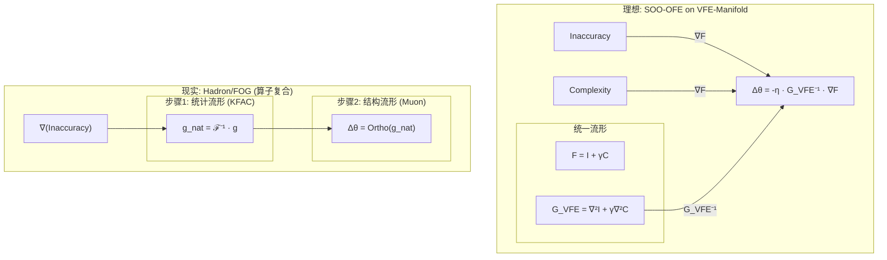

# Hadron 优化器的理论批判与 VFE 流形构想

**版本**: 1.0 (2025-11-15)  
**作者**: Ω Researcher  
**状态**: 理论构想，下一步研究方向

## 1. 核心洞察

`Hadron` (`FOG`/`DiagFOG`) 优化器的成功是经验性的，而非理论完备的。其根本缺陷在于，它通过**算子复合 (Operator Composition)** 串联了两个独立的几何空间（KFAC 的统计流形和 Muon 的结构流形），而未能在一个统一的 **变分自由能流形 (Variational Free Energy Manifold, VFE-Manifold)** 上进行操作。

## 2. 变分自由能流形 (VFE-Manifold) 的形式化定义

根据自由能原理 (FEP)，一个真正的二阶优化-观测自由能 (SOO-OFE) 优化器应最小化总的自由能 `F`：

`F = Inaccuracy + γ · Complexity`

该 VFE 流形的度量张量 `G_VFE` 必然是 `F` 的曲率（Hessian）：

`G_VFE = ∇²F = ∇²(Inaccuracy) + γ · ∇²(Complexity)`

理想的更新规则应为：

`Δθ = -η · G_VFE⁻¹ · ∇F`

## 3. Hadron 的“原罪”：启发式替代方案

Hadron 的实现偏离了上述理想路径：

1. **度量不完整**: 它仅使用 Fisher 信息 `ℱ ≈ ∇²(Inaccuracy)` 作为度量，完全忽略了 `∇²(Complexity)` 项。
2. **目标不完整**: 它仅使用 `∇(Inaccuracy)` 作为梯度，忽略了 `∇(Complexity)`。
3. **操作非原生**: 它将 KFAC 计算出的“不完整”自然梯度，交给 Muon 算子在一个独立的正交流形上进行启发式投影。这是一种串联的、非原生的操作。

Hadron 用一个**结构性约束**（正交化）作为了**可微复杂度成本**的启发式替代品。

## 4. 计算挑战与未来研究方向

核心挑战在于 `∇²(Complexity)` 的计算不可行性。未来的研究必须聚焦于此：

1. **寻找可计算的代理**: 能否设计一种 `Complexity` 度量，其二阶导数在计算上是友好的（如对角、低秩）？
2. **动态度量融合**: 设计一种元学习机制，动态融合统计度量 `ℱ` 和一个新定义的结构度量 `S`，以近似 `G_VFE`。例如 `G_VFE ≈ (1-λ(PI))ℱ + λ(PI)S`。
3. **重审三阶信息**: 探索利用三阶信息（如 `Hessian-vector product`）来近似 `∇²(Complexity)` 项的可能性，但需避免重蹈 Hessian-Fisher 等价性的覆辙。

此文档确立了我们下一阶段的核心理论攻关方向：从工程上的“巧合”回归到理论上的“完备”，真正实现 SOO-OFE。
